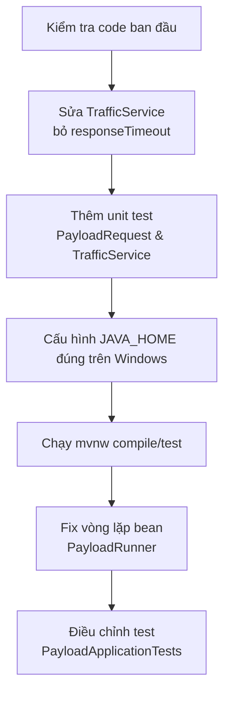

## Tổng quan

Tài liệu này tóm tắt các bước cấu hình / sửa lỗi và thay đổi mã nguồn đã thực hiện cho project `payload` ngày 2025‑12‑15.

### Mục tiêu chính

- Chạy được Maven với `JAVA_HOME` hợp lệ.
- Sửa lỗi cấu hình `WebClient` trong `TrafficService`.
- Viết test đơn giản cho các lớp chính.
- Loại bỏ lỗi khi chạy test Spring Boot (`PayloadApplicationTests`).

## Dòng thời gian thay đổi (tóm tắt)

## Các thay đổi mã nguồn chính

| Khu vực | Thay đổi chính | Ghi chú |
|--------|----------------|--------|
| `TrafficService` | Xóa `.responseTimeout(Duration.ofSeconds(10))` khỏi `WebClient.Builder` | Phương thức này không tồn tại trên `WebClient.Builder` trong WebFlux hiện tại, gây lỗi compile. |
| `PayloadRequestTest` | Thêm test kiểm tra constructor, getter, setter | Đảm bảo ánh xạ thuộc tính (bao gồm `getPayloadId()`) hoạt động đúng. |
| `TrafficServiceTest` | Thêm test `sendRandomRequestDoesNotThrow` | Kiểm tra việc gửi một request ngẫu nhiên không ném exception đồng bộ. |
| `PayloadRunner` | Thay tự‑tiêm `PayloadRunner` bằng constructor tiêm `TrafficService` và gọi `startTrafficSimulation()` | Xóa vòng lặp bean `PayloadRunner -> PayloadRunner`, runner giờ dùng `TrafficService`. |
| `PayloadRunner` | Thêm `@Profile("!test")` | Tránh tạo bean runner khi chạy test Spring Boot, giảm side‑effects. |
| `PayloadApplicationTests` | Đổi từ `@SpringBootTest` sang test JUnit đơn giản không load context | Loại bỏ lỗi `Failed to load ApplicationContext` và giữ test suite nhẹ. |

## Cấu hình & build

- Hướng dẫn cấu hình `JAVA_HOME` trỏ tới thư mục JDK thực tế (ví dụ `C:\Program Files\Java\jdk-25`) và thêm `%JAVA_HOME%\bin` vào `Path`.
- Sau khi cấu hình đúng, project build thành công với:
  - `.\mvnw.cmd -DskipTests compile`
  - `.\mvnw.cmd test` (sau khi điều chỉnh lại các test như trên).

## Trạng thái cuối

- Code compile thành công.
- Test `PayloadRequestTest` và `TrafficServiceTest` chạy OK.
- Test `PayloadApplicationTests` được đơn giản hóa để không phụ thuộc vào Spring context phức tạp, giúp toàn bộ test suite chạy ổn định.

